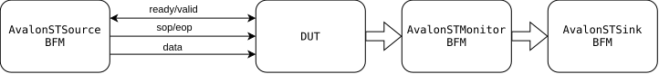

<!--
Copyright 2026 Yaroslav Mariukha
SPDX-License-Identifier: RPL-1.5
-->

# Avalon-ST

Avalon-ST helpers connect cocotb to a valid/ready stream. `AvalonFormat`
defines how symbols occupy a data word; a source drives transfers, a sink
receives them, and a monitor observes them without owning `ready`.



A transfer happens on a clock edge only when both `valid` and `ready` are high.
A frame groups consecutive accepted beats. In packet mode the frame also
carries start/end boundaries and sideband fields such as `channel`, `error` and
`empty`.

<div class="wavedrom">
<script type="WaveDrom" data-wavedrom-skin="auto">
{
  signal: [
    { name: "clk",   wave: "p......." },
    { name: "ready", wave: "01..01.." },
    { name: "valid", wave: "0.1..0.." },
    { name: "data",  wave: "x.=.=x..", data: "0x11 0x22" }
  ]
}
</script>
</div>

## Format and signal names

Use `AvalonSTBus.from_prefix()` when interface signals share a prefix. The
format describes symbol width, symbols per beat, and their word order; it is
not a description of a specific IP.

```python
from cocotbext.avalon import AvalonFormat, AvalonSTBus

fmt = AvalonFormat(
    bits_per_symbol=8,
    symbols_per_beat=4,
    first_symbol_in_high_order_bits=False,
)

source_bus = AvalonSTBus.from_prefix(dut, "din")
sink_bus = AvalonSTBus.from_prefix(dut, "dout")
print(fmt.payload_width)  # 32 bits
```

`first_symbol_in_high_order_bits=False` means the first logical symbol occupies
the least-significant bits. Use the same format in the driver, monitor, codec
and scoreboard; inconsistent formats cause apparently valid but scrambled data.

## Source and sink loopback

The following cocotb test sends one five-symbol packet through a generic DUT.
The sink pauses once every four cycles, so the example exercises backpressure
as well as payload transfer.

```python
import cocotb
from cocotb.clock import Clock
from cocotb.triggers import RisingEdge
from cocotbext.avalon import (
    AvalonFormat,
    AvalonSTBus,
    AvalonSTFrame,
    AvalonSTSink,
    AvalonSTSource,
)


def pause_every_fourth_cycle():
    while True:
        yield False
        yield False
        yield False
        yield True


@cocotb.test()
async def stream_loopback_test(dut):
    cocotb.start_soon(Clock(dut.clk, 10, units="ns").start())
    dut.reset.value = 1
    await RisingEdge(dut.clk)
    dut.reset.value = 0

    fmt = AvalonFormat(bits_per_symbol=8, symbols_per_beat=4)
    source = AvalonSTSource(
        AvalonSTBus.from_prefix(dut, "din"), fmt, dut.clk,
        reset=dut.reset, packets=True, idle_value=0,
    )
    sink = AvalonSTSink(
        AvalonSTBus.from_prefix(dut, "dout"), fmt, dut.clk,
        reset=dut.reset, packets=True,
    )
    sink.set_pause_generator(pause_every_fourth_cycle())

    await source.send(AvalonSTFrame([0x11, 0x22, 0x33, 0x44, 0x55]))
    received = await sink.recv()
    assert received.data == [0x11, 0x22, 0x33, 0x44, 0x55]
```

A source may itself be paused to create gaps in `valid`. A sink pause controls
`ready`. Use deterministic pauses in a directed test and seeded random pauses
in a stress test.

```python
def random_pause(seed=1, probability=0.25):
    import random

    rng = random.Random(seed)
    while True:
        yield rng.random() < probability


source.set_pause_generator(random_pause(seed=1))
sink.set_pause_generator(random_pause(seed=2))
```

## Frames, beats and packet endings

`AvalonSTFrame` is the logical message API. `AvalonSTBeat` is useful when a
test must inspect individual accepted transfers.

```python
from cocotbext.avalon import AvalonSTBeat, AvalonSTFrame

frame = AvalonSTFrame(data=[0x11, 0x22, 0x33], channel=2, error=0)
beat = AvalonSTBeat(
    data=0x00332211,
    symbols=[0x11, 0x22, 0x33, 0x00],
    sop=1,
    eop=0,
)
```

In packet mode, an incomplete final beat uses `empty` to mark unused symbols.
The source inserts correct `sop`, `eop` and `empty`; the sink reconstructs only
the meaningful symbols. Count accepted beats when measuring transport
performance, but count symbols or payload values when checking application
content.

## Passive observation

Use `AvalonSTMonitor` to inspect an existing stream without driving `ready`.
It can return complete frames or individual beats and is suitable for an input
tap, a protocol checker or a performance monitor.

```python
from cocotbext.avalon import AvalonSTMonitor

monitor = AvalonSTMonitor(
    bus=AvalonSTBus.from_prefix(dut, "tap"),
    fmt=fmt,
    clock=dut.clk,
    reset=dut.reset,
    packets=True,
)
frame = await monitor.recv()
beat = await monitor.recv_beat()
```

The monitor records timestamps on observed frames. They are used later by
[stream performance](performance.md). It is passive: use a sink when the
testbench must actively apply backpressure.

## Reset and diagnostics

Pass the reset signal to every source, sink and monitor. Use the appropriate
`reset_active_level` for active-low resets, and wait for reset release before
sending traffic. Keep `idle_value` explicit when zero is not the required idle
bus value.

When a test fails, log the frame summary, accepted beat count, sideband fields
and pause seed. Those four values usually distinguish a protocol-ordering bug,
a payload packing mismatch, and a randomisation reproduction problem.

Next: [add packet meaning with Intel Avalon-ST Video](intel-video.md).
