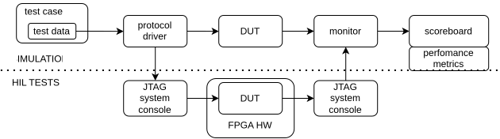

<!--
Copyright 2026 Yaroslav Mariukha
SPDX-License-Identifier: RPL-1.5
-->

# FPGA Verification

`fpga-verification` is a Python library of reusable verification components,
developed primarily for Intel/Altera FPGA video-processing systems. It also
provides cocotb BFMs for Altera-specific protocols such as Avalon-ST and
Avalon-MM, along with models for components such as DMA controllers.

The library supports verification workflows for components from:

- [Video and Vision Processing Suite (VVP)](https://www.altera.com/products/ip/po-3150/video-and-vision-processing-suite)
- [Video and Image Processing Suite (VIP)](https://docs.altera.com/r/docs/683416/22.1/video-and-image-processing-suite-user-guide/about-the-video-and-image-processing-suite)

The library provides a UVM-like testbench structure built on cocotb and pyuvm.
It keeps test data, protocol conversion, reference behaviour, and simulation
plumbing in separate layers. This allows the same prediction code to be reused
in fast unit tests, cocotb simulations, and hardware-in-the-loop tests.

It includes:

- cocotb helpers for Avalon-ST and Avalon-MM interfaces;
- Intel Avalon-ST Video packet codecs and pyuvm verification components;
- simulation runners for plain RTL, Intel components, and Platform Designer;
- a black-box Intel DMA model and sparse byte memory;
- stream latency and throughput measurements;
- simulator-independent video and numeric data helpers;
- persistent Intel System Console access for hardware-in-the-loop tests.

!!! note
    Hardware-in-the-loop functionality is under development.

## Start here

1. [Install the package](getting-started/install.md).
2. [Run the minimal testbench](getting-started/minimal-testbench.md).
3. Follow the complete [video-packet endianness tutorial](tutorial/stream-pipeline.md).

The example preserves packet order, identifier beats, CONTROL packets and USER
packets. It reverses the valid bytes within each VIDEO payload beat, including
a partial final beat.

The tutorial shows how to assemble a working testbench. The
[architecture](guide/architecture.md) and [modeling](guide/modeling.md) chapters
explain why the responsibilities are separated. Focused how-to guides cover
runners, interfaces, data formats, performance and hardware access.

The case studies describe reusable verification problems:

- a [stateless stream converter](case-studies/stateless-converter.md);
- a [stateful frame transform](case-studies/stateful-transform.md);
- a [memory-backed streaming component](case-studies/memory-backed-component.md).

Use the generated [API reference](reference/simulation.md) when you already know
which component you need.

## Project links

- [Package on PyPI](https://pypi.org/project/fpga-verification/)
- [Source repository](https://github.com/yarko18/fpga-verification)
