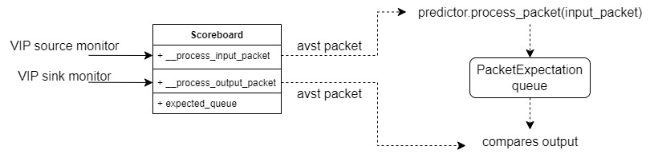

<!--
Copyright 2026 Yaroslav Mariukha
SPDX-License-Identifier: Apache-2.0
-->

# Intel Avalon-ST Video Protocol

Reference documentation: [Video and Image Processing Suite](https://docs.altera.com/r/docs/683416/22.1/video-and-image-processing-suite-user-guide/about-the-video-and-image-processing-suite)

```python
from fpga_verification.protocols.avalon_st.intel_video import (
    IntelVIPFrameCodec,
    VIPControlPacket,
)
from fpga_verification.video import FrameSize, ImageGenerator, VideoFormat

fmt = VideoFormat(
    bits_per_color=10,
    pixels_in_parallel=2,
)
size = FrameSize(width=640, height=480)
frame = ImageGenerator(fmt, rng=1).random(size)
codec = IntelVIPFrameCodec(fmt)

packet_symbols = codec.frame_to_packet_symbols(frame, size)
decoded = codec.packet_symbols_to_frame(packet_symbols, size)
```

Every encoded packet starts with a complete identifier beat. Unused symbols
in that identifier beat are zero. Control packets are padded to complete beats
because the control payload has a fixed nine-symbol format. Video and user
packets do not add payload padding to `to_symbols()`; a final partial wire beat
is represented by Avalon-ST `empty` when driven through the bus helpers.

Intel VIP video payload is a continuous raster stream. It is not padded at the
end of every row. For a frame of size `width × height` with `planes` color
planes, the valid video payload contains exactly `width * height * planes`
symbols.

Pixel decoding always uses the explicit `FrameSize`; it never derives geometry
from the control packet. Control validation is a separate operation:

```python
codec.validate_control_packet(control_packet, size)
```

The codec is stateless. User, control, and video packet adapters do not retain
packet history and do not run an internal state machine.


## pyuvm agent

The simulation extra provides a source/sink agent with the same topology as
a conventional streaming data agent:

```python
from fpga_verification.sim.agents import VIPAgent, VIPSequence

vip_agent = VIPAgent(
    "vip_agent",
    parent=self,
    clock=clock,
    reset=reset_n,
    reset_active_level=False,
    source_bus=din_bus,
    sink_bus=dout_bus,
    source_fmt=fmt,
    sink_fmt=fmt,
)

packets = codec.frame_to_packets(frame, size)
sequence = VIPSequence.from_packets(packets, name="input_frame")
await sequence.start(vip_agent.sequencer)
```

`VIPMonitor` converts each observed Avalon-ST packet to a `VIPPacket`, checks
the packet stream, and publishes it through its analysis port. The source and
sink monitors keep independent protocol-checker state.

`VIPAgent` creates these monitors automatically for the buses provided to the
constructor:

- `source_bus` creates `source_monitor`; in active mode the same bus is driven
  by the source driver and sequencer;
- `sink_bus` creates `sink_monitor`; in active mode it also drives ready and
  can randomize backpressure;
- both monitors publish decoded packets through `analysis_port`;
- `packet_logging=True` enables summaries such as
  `nuc_component.dout: got vip video packet (2048 symbols)`.

The monitor enforces:

- at least one control packet must be observed before the first video packet;
- asserting reset clears the active control resolution, so the first video
  packet after reset requires a new control packet.

`VIPProtocolChecker` can also compare video payload length against the
resolution in the most recently observed control packet. In the current default
mode a mismatch is logged as a warning. Set
`checker.check_video_packet_size = True` to raise `VIPProtocolError` instead;
in that strict mode a frame-size change with a different wire payload length
requires a new control packet before the video packet.

The state belongs to `VIPProtocolChecker`, not to `IntelVIPFrameCodec`. It can
also be used directly:

```python
from fpga_verification.protocols.avalon_st.intel_video import (
    VIPProtocolChecker,
)

checker = VIPProtocolChecker(fmt)
for packet in observed_packets:
    checker.observe(packet)
```

Intel VIP video packets carry samples but no width or height. Consequently,
two different geometries that produce exactly the same number of valid payload
symbols cannot be distinguished by a passive monitor. This includes equal-area
resolutions. Such a change can only be checked where the intended `FrameSize`
is available, while the passive agent strictly checks all changes observable on
the wire.


## Base VIP predictor and scoreboard

The simulation package includes a predictor/scoreboard pair for packet-level
VIP tests. `BaseVIPPredictor` consumes input packets and creates expected
output packet descriptions. `BaseVIPScoreboard` receives input and output
analysis streams, queues those expectations, and compares DUT output packets
against them.

```python
from fpga_verification.sim.models import BaseVIPPredictor
from fpga_verification.sim.scoreboards import BaseVIPScoreboard


class MyVIPPredictor(BaseVIPPredictor):
    def get_tolerance(self):
        return 1


scoreboard = BaseVIPScoreboard("vip_scoreboard", self, source_fmt=fmt, sink_fmt=fmt)
scoreboard.predictor = MyVIPPredictor(
    core=model,
    input_codec=scoreboard.vip_input_codec,
    output_codec=scoreboard.vip_output_codec,
)

vip_agent.source_monitor.analysis_port.connect(scoreboard.data_in_export)
vip_agent.sink_monitor.analysis_port.connect(scoreboard.data_out_export)
```

The scoreboard exposes two analysis exports:

- `data_in_export`: connect to packets observed before the DUT, usually
  `vip_agent.source_monitor.analysis_port`;
- `data_out_export`: connect to packets observed after the DUT, usually
  `vip_agent.sink_monitor.analysis_port`.

Predictor behavior:

- control packets update the active input `FrameSize` and emit an expected
  output control packet using `expected_output_size(input_size)`;
- video packets are decoded to neutral frames, passed through
  `process_frame(frame, size)`, and encoded back to expected output video
  packets;
- unsupported or corrupt input frames can return expectations with
  `compare=False`, causing the scoreboard to skip frame content comparison;
- `support_passthrough=True` allows passthrough mode, where input frames are
  expected unchanged;
- override `_process_user_packet()` if the IP forwards or transforms user
  packets.

Scoreboard behavior:

- `predictor` must be assigned before packets arrive;
- output control packets compare width, height, and interlacing;
- output video packets compare decoded frames with `compare_frames()` using the
  predictor expectation tolerance;
- `enable_compare=False` keeps ordering checks but disables frame content
  comparison;
- `wait_frame_checked()` waits until one more output frame has been checked.

Packet-flow diagram:




### Packet Type Identifiers

| Type Identifier D0[3:0] | Description                              |
| ----------------------- | ---------------------------------------- |
| 0x0 (0)                 | Video data packet                        |
| 0x1–0x8 (1–8)           | User data packet                         |
| 0x9–0xC (9–12)          | Reserved                                 |
| 0xD (13)                | Clocked Video data ancillary user packet |
| 0xE (14)                | Reserved                                 |
| 0xF (15)                | Control packet                           |


### Interlaced Nibble of Control Packet

| Interlaced/Progressive | Interlacing[3:0] | Description                                                          |
| ---------------------- | ---------------- | -------------------------------------------------------------------- |
| Interlaced             | 0b1100             | Interlaced F1 field, paired with the following F0 field              |
| Interlaced             | 0b1101             | Interlaced F1 field, paired with the preceding F0 field              |
| Interlaced             | 0b111x             | Interlaced F1 field, pairing don’t care                              |
| Interlaced             | 0b1000             | Interlaced F0 field, paired with the preceding F1 field              |
| Interlaced             | 0b1001             | Interlaced F0 field, paired with the following F1 field              |
| Interlaced             | 0b101x             | Interlaced F0 field,pairing don’t care                               |
| Progressive            | 0b0x01             | Progressive 0 x 0 1 Progressive frame, deinterlaced from an f1 field |
| Progressive            | 0b0x00             | Progressive frame, deinterlaced from an f0 field                     |
| Progressive            | 0b0x1x             | Progressive frame                                                    |

## Python structure:

`VIPPacket`:
 - `VIPControlPacket`
 - `VIPVideoPacket`
 - `VIPUserPacket`

`VIPFrame`
 - control packet
 - optional user packets
 - video packet
